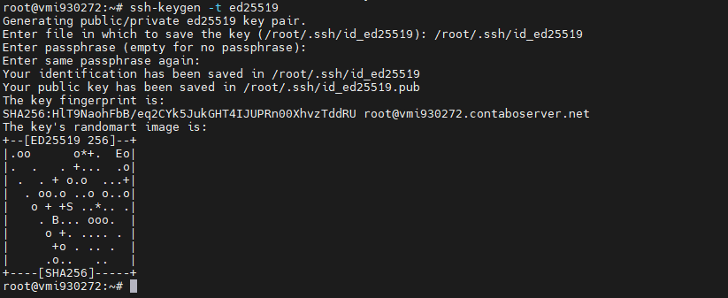
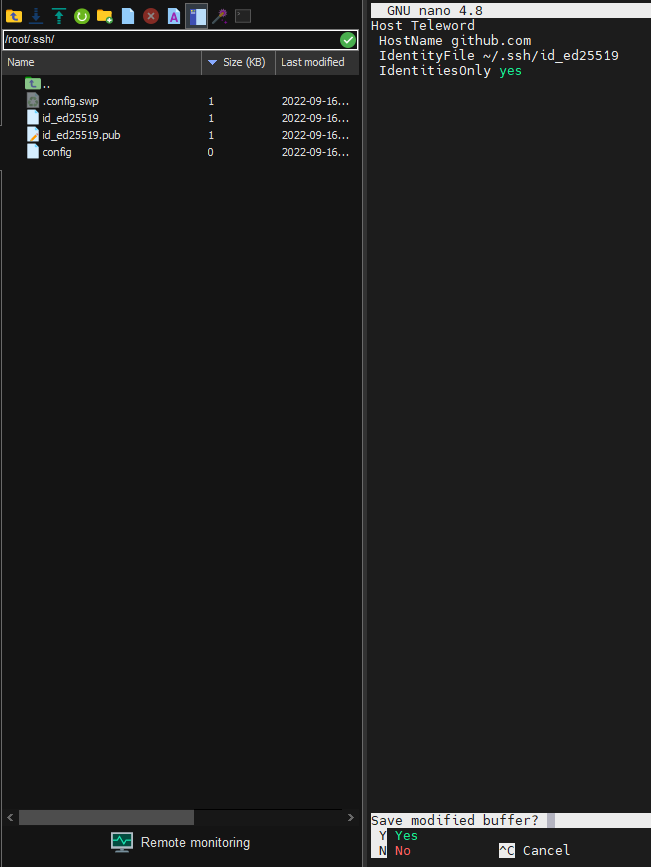
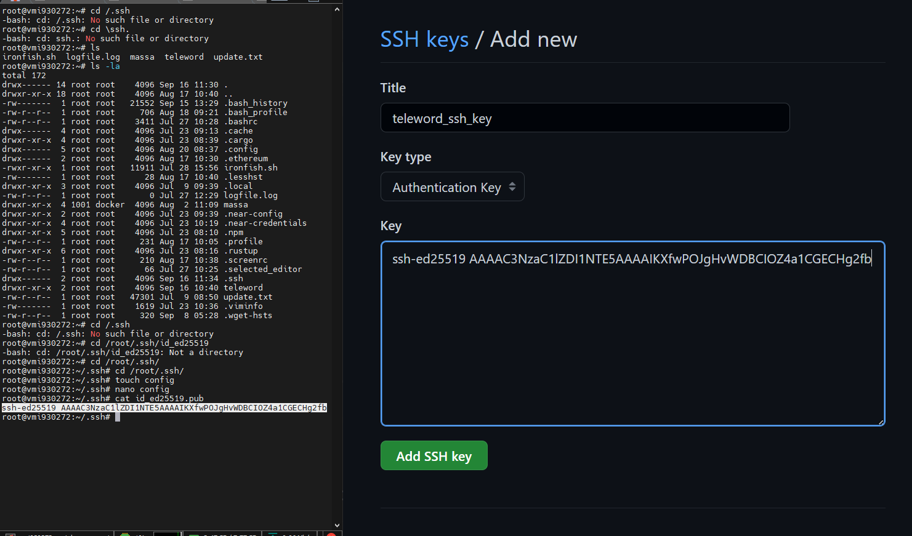
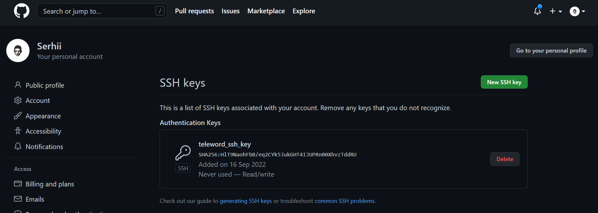
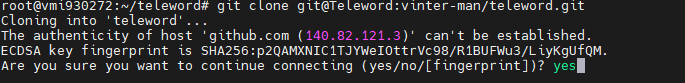
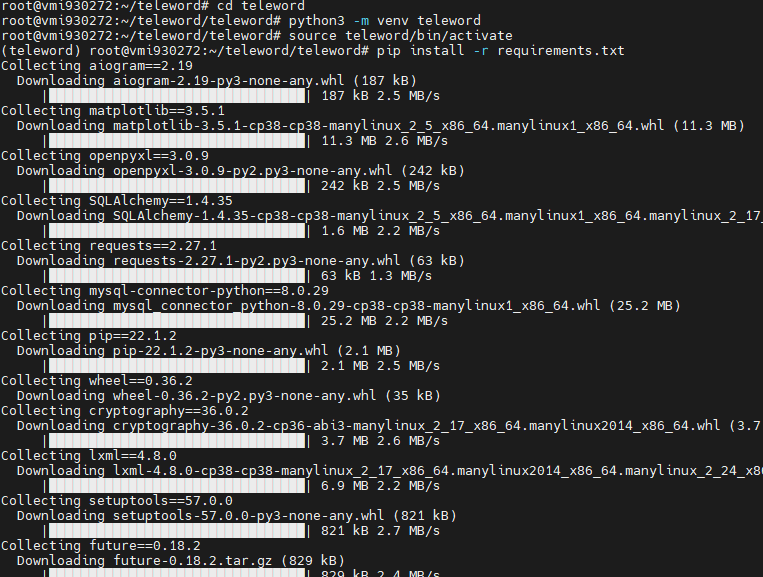

# Teleword
* Publication date: 2022-05-27 

## Installation on the server

Let's make sure the linux machine is up-to-date.
```
sudo apt update && sudo apt upgrade -y
```
Installing useful packages
```
sudo apt install git openssh
```
Let's generate sssh keys using the s4lv [ed25519](https://ru.wikipedia.org/wiki/EdDSA) method
```
ssh-keygen -t ed25519 
```


Setting up access to sssh keys
```
cd /root/.ssh/
touch config
```
```
nano config
```
```
Host <SSH NAME>
 HostName github.com
 IdentityFile ~/.ssh/<KEY>
 IdentitiesOnly yes
```



Copy the public key and transfer it to github
```
 cat <KEY>.pub
```




```
cd #
git clone git@<SSH NAME>:vinter-man/teleword.git
```
> yes




```
nano teleword/config/config.py
```
> Do not forget to change the config file for yourself.

## Systemd | Screen
Let's move on to setting up a virtual environment
```
sudo apt install -y make build-essential libssl-dev zlib1g-dev \
> libbz2-dev libreadline-dev libsqlite3-dev wget curl llvm libncurses5-dev\
> libncursesw5-dev xz-utils tk-dev libffi-dev liblzma-dev python-openssl
```
```
git clone https://github.com/pyenv/pyenv.git ~/.pyenv
```
```
echo 'export PYENV_ROOT="$HOME/.pyenv"' >> ~/.bashrc
echo 'export PATH="$PYENV_ROOT/bin:$PATH"' >> ~/.bashrc
echo -e 'if command -v pyenv 1>/dev/null 2>&1; then\n eval "$(pyenv init -)"\nfi' >> ~/.bashrc
```
```
pyenv in tall 3.10.2
pyenv rehash
eval "$(pyenv init -)"
sudo apt install python3-venv
cd teleword
pyenv local 3.10.2
python -m venv <VENV NAME>
source <VENV NAME>/bin/activate
pip install -r requirements.txt
```

After a successful launch, you can exit

Now you have to decide how it will be most convenient for you to launch your bot for continuous operation.

### Screen
```
sudo apt install screen
screen -S teleword
python teleword.py
```


### Systemd

Let's create and run the service
```
sudo nano /etc/systemd/system/teleword.service
```
```
[Unit]
Description=Teleword
After=network.target

[Service]
Type=simple
User=root
ProtectHome=false
WorkingDirectory=/root/teleword/
ExecStart=/root/teleword/<VENV NAME>/bin/python teleword.py
Restart=on-failure
RestartSec=10
LimitNOFILE=4096

[Install]
WantedBy=multi-user.target
```
After saving the service file, let's start Teleword
```
sudo systemctl daemon-reload
sudo systemctl enable teleword
sudo systemctl restart teleword
sudo systemctl status teleword
```
View logs in real time
```
journalctl -u teleword -f
```

## Docker
Let's install the necessary
```
sudo apt install apt-transport-https
curl -fsSL https://download.docker.com/linux/ubuntu/gpg | sudo apt-key add -
sudo apt install docker
```
```
cd teleword
docker build -t teleword .
```
```
docker run \
  -d \
  -p 26256:80 \
  --name teleword \
  teleword
```
View logs in real time
```
docker logs teleword -f --tail 100
```

## Docker-compose
Install [docker-compose](https://docs.docker.com/desktop/install/ubuntu/) 
```
cd teleword
docker compose up -d --build
```
View logs in real time
```
cd teleword
docker compose logs -f --tail 10
```
