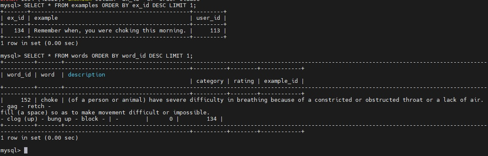
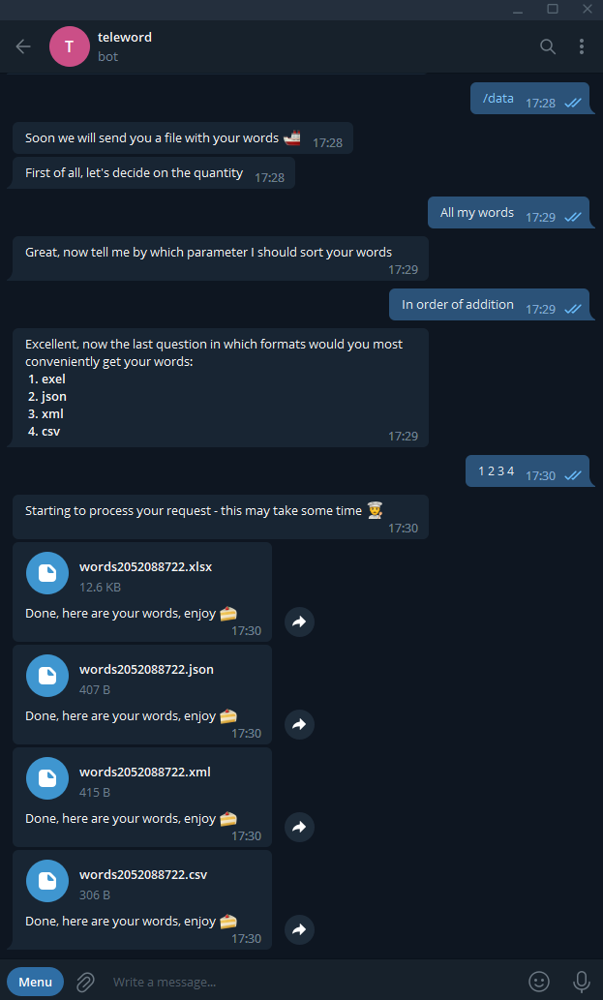

* 🧳 Launched May 2022
* 🚪 Release v2.2.1
* 📦Code size 300 КB
* :uk: languages


## Short description
Add your own learned words to the app to reinforce your knowledge with a daily quiz. 

Lessons are formed by priority words. The more often the user uses the bot, the more productive it works. 

Checks such as card-word, word-card - with a regular approach, they allow you to very effectively consolidate the learned words, especially when the user chooses his own examples with words.

Track your progress. Train every day. Edit words. Build your code on top of the API.

You can check how the user part of the telegram [bot](https://t.me/tele_word_learning_bot) works.

---

## Table of contents

* [User guide](#user-guide)
  * [First steps](#fs)
  * [Adding new words](#adw)
  * [Lesson](#lesson)
  * [Statistic](#stat)
  * [Get, change, delete](#gcd)
  * [API](#api)
* [Installation guide](#installation)
  * [Systemctl | Screen](#systectl_screen)
    * [Systemctl](#systemctl)
    * [Screen](#screen)
  * [Docker](#docker)
  * [Docker compose](#docker-compose)
* [Contact](#contact)

---
---

## <a name="user-guide"></a> User guide
A quick overview of the main functionality
### <a name="fs"></a> First steps
First of all, you enter the bot using the ```/start``` command

And ```/help``` command to get to the main menu


> :suspect: The user is verified; the data is entered into the table
> 
>
>
>

### <a name="adw"></a> Adding new words
Now it's time to add new data, this is how it usually looks for me

I open the series with subtitles, a dictionary (for me, it's just a browser) and a Teleword


I watch a series until I stumble upon an unfamiliar word

I write down a remark with this word and look it up in the dictionary


I copy the description and wait for a successful addition


Great, I click ```continue``` and continue to enjoy the series only a level smarter than I was 30 seconds ago


> :hurtrealbad: Under the hood:
>- the data is checked for correctness
>- the part of speech of the word is pulled up for more effective testing
>- rating is being prepared
> 
>
> 
>

### <a name="lesson"></a> Lesson
You have added more than 15 initial words (I recommend at least 30-40) - now you can start(```/lesson```) filling words 
with tests 


This is what we remember! Let's read the example again to strengthen our knowledge.


> :godmode: One of the hardest parts of the backend is hidden behind the lesson formations.
> 
> It is after the lesson that all user statistics are collected - his mistakes, successes, attendance, the rating of words changes. 
> 
> The occupation itself is formed by repeated enumeration with a bit of randomness.
> 
> You can see Python code in functions  ```db_worker.get_lesson_data()```
> 
> The logic for checking the correctness of the answer is enclosed in two coroutines:
> - one of them checks if the lesson is finished, generates a task from the radis and displays it to the user ```handlers.lessons.cb_get_task_number_issues_task```
> - the other one catches the user's response and, depending on the correctness, launches the coroutine, passing it the current data about the lesson ```handlers.lessons.ms_get_answer_set_task``` 
 
### <a name="stat"></a> Statistic
Who doesn't like to look at statistics? Make a smart face and click ```/statistiс```


> :rage1: We climb into the database with difficult queries, count the number of words ```db_worker.word_count()```, and the user tables pull out data on the total number of points and the number of shock days of the user ```db_worker.get_user()```. 
>
> We transfer data by day from the statistics table to plotting through matpotlib
> 
> ```db_worker.get_user_stat()``` -> ```db_worker.build_total_mistakes_firsttry_data_for_graph()``` -> ```handlers.statistic.build_graph()```
> 
> 
> 

### <a name="gcd"></a> Get, change, delete
We do not hide anything from users, if they need words with the right data type - hold on command ```/data```



If you are a regular user - my advice to you - enjoy a beautiful  ```1. exel``` file :sunglasses:


The logic is simple, choose what and with what you want to do and do it


> :suspect: The logic is simple - give the user the opportunity to edit their data on the sql data ids.
> 
> By revalidating the input, checking permissions, and running a cascading deletion of words when trying to delete an example.

### <a name="api"></a> API

Or maybe we want to develop something of our own on the Teleword api? Then let's kindly distract our good old friend admin from swimming in the Mediterranean Sea and drinking cocktails


While we wait, we can study detailed instructions for use


> :shipit: All methods of the restful interface are implemented via flask-api in a separate synchronous  ```api.py``` module.
> 
> To use the request key - the administrator must personally process the request and issue the key to the user.
> 
> 
---
---

## <a name="installation"></a> Installation on the server

Let's make sure the linux machine is up-to-date.
```
sudo apt update && sudo apt upgrade -y
```
Installing useful packages
```
sudo apt install git openssh
```
Let's generate sssh keys using the s4lv [ed25519](https://ru.wikipedia.org/wiki/EdDSA) method
```
ssh-keygen -t ed25519 
```


Setting up access to sssh keys
```
cd /root/.ssh/
touch config
```
```
nano config
```
```
Host <SSH NAME>
 HostName github.com
 IdentityFile ~/.ssh/<KEY>
 IdentitiesOnly yes
```


Copy the public key and transfer it to GitHub
```
 cat <KEY>.pub
```


```
cd #
git clone git@<SSH NAME>:vinter-man/teleword.git
```
> yes


```
nano teleword/config/config.py
```
> Do not forget to change the config file for yourself.

### <a name="systectl_screen"></a> Systemctl | Screen
Let's move on to setting up a virtual environment
```
sudo apt install -y make build-essential libssl-dev zlib1g-dev \
> libbz2-dev libreadline-dev libsqlite3-dev wget curl llvm libncurses5-dev\
> libncursesw5-dev xz-utils tk-dev libffi-dev liblzma-dev python-openssl
```
```
git clone https://github.com/pyenv/pyenv.git ~/.pyenv
```
```
echo 'export PYENV_ROOT="$HOME/.pyenv"' >> ~/.bashrc
echo 'export PATH="$PYENV_ROOT/bin:$PATH"' >> ~/.bashrc
echo -e 'if command -v pyenv 1>/dev/null 2>&1; then\n eval "$(pyenv init -)"\nfi' >> ~/.bashrc
```
```
pyenv in tall 3.10.2
pyenv rehash
eval "$(pyenv init -)"
sudo apt install python3-venv
cd teleword
pyenv local 3.10.2
python -m venv <VENV NAME>
source <VENV NAME>/bin/activate
pip install -r requirements.txt
```

After a successful launch, you can exit

Now you have to decide how it will be most convenient for you to launch your bot for continuous operation.

#### <a name="screen"></a> Screen 
```
sudo apt install screen
screen -S teleword
python teleword.py
```
View logs in real time
```
screen -r teleword
```


#### <a name="systemctl"></a> Systemctl 

Let's create and run the service
```
sudo nano /etc/systemd/system/teleword.service
```
```
[Unit]
Description=Teleword
After=network.target

[Service]
Type=simple
User=root
ProtectHome=false
WorkingDirectory=/root/teleword/
ExecStart=/root/teleword/<VENV NAME>/bin/python teleword.py
Restart=on-failure
RestartSec=10
LimitNOFILE=4096

[Install]
WantedBy=multi-user.target
```
After saving the service file, let's start Teleword
```
sudo systemctl daemon-reload
sudo systemctl enable teleword
sudo systemctl restart teleword
sudo systemctl status teleword
```
View logs in real time
```
journalctl -u teleword -f
```

### <a name="docker"></a> Docker
Let's install the necessary
```
sudo apt install apt-transport-https
curl -fsSL https://download.docker.com/linux/ubuntu/gpg | sudo apt-key add -
sudo apt install docker
```
```
cd teleword
docker build -t teleword .
```
```
docker run \
  -d \
  -p 26256:80 \
  --name teleword \
  teleword
```
View logs in real time
```
docker logs teleword -f --tail 100
```

### <a name="docker-compose"></a> Docker-compose
Install [docker-compose](https://docs.docker.com/desktop/install/ubuntu/) 
```
cd teleword
docker compose up -d --build
```
View logs in real time
```
cd teleword
docker compose logs -f --tail 10
```

---
---


## <a name="contact"></a> Contact

* Telegram - https://t.me/vindemure
* Mail -   serhiivinterman@gmail.com

---
---


---
---


